# Lab 1

## Introduction

Let's get to know the application, shall we?

## Setup

Browse to http://saintcon2019.hackerapps.cloud/

## Learning the application

When you arrive at the site, you'll see that a random list name was generated for you:

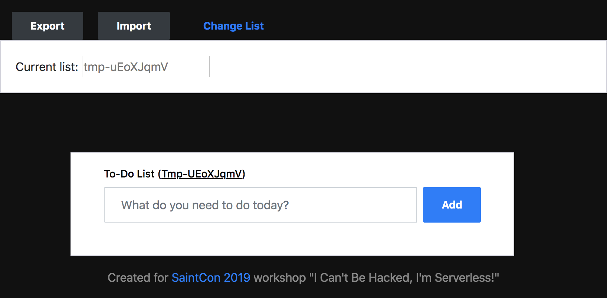

This helps ensure you don't collide with other participants. If that sounded like a warning or foreshadowing... it was...

Note that the name of the list is saved in local storage. To view local storage on Chrome, right click the page, click "Inspect", click the "Application" tab, and on the left, expand "Local Storage". You should see your temporary list name in local storage:

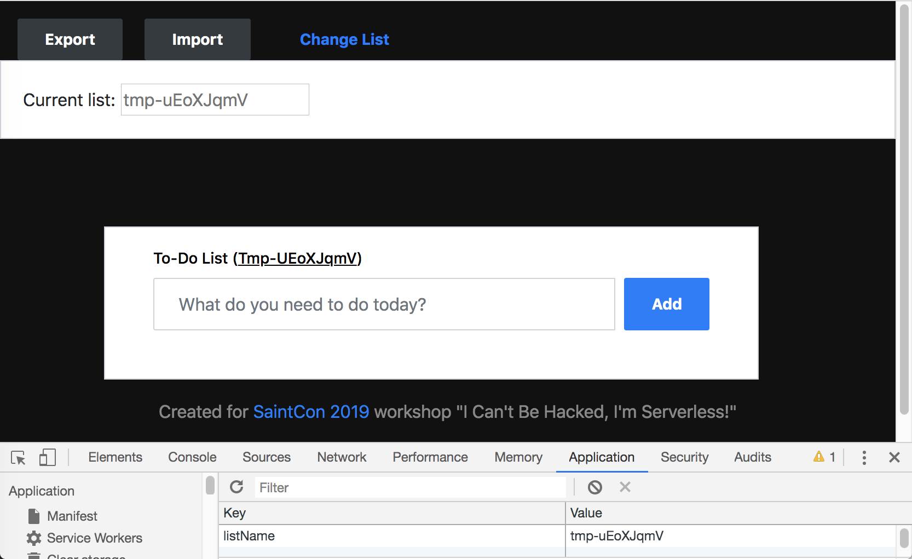

> To view localstorage in Safari, go to Safari > Preferences > Advanced and make sure "Show Develop menu in menu bar" is checked. You can access the inspector via Develop > Show Web Inspector.

> To view local storage in Firefox, go to Tools > Web Developer > Inspector.

To change the list you're using, enter a new name in the "Current list" box. If you don't see that box, you can click "Change List" to expand the drawer it lives in.

When you select a name for your list, try to pick something unique. For demonstration purposes I'll use `m0rris`, and submit with `<ENTER>`. Note that the change is reflected in the DOM (the web page) and in local storage:

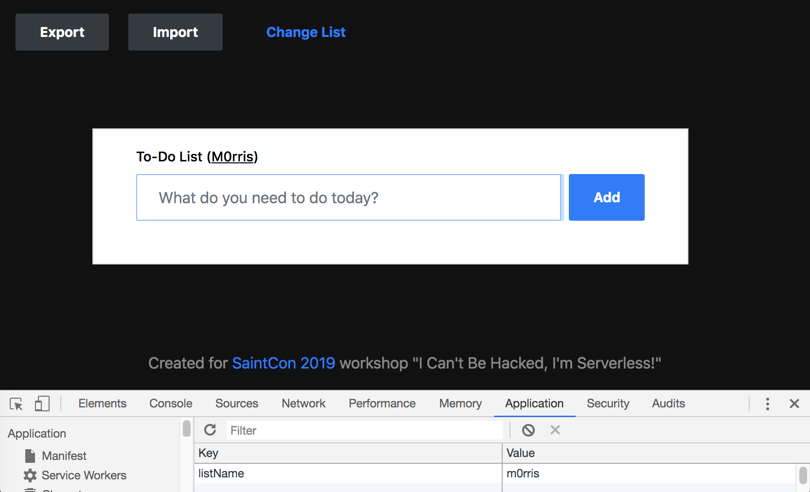

You can now add items to the list, and they will be reflected in the DOM and on the backend.

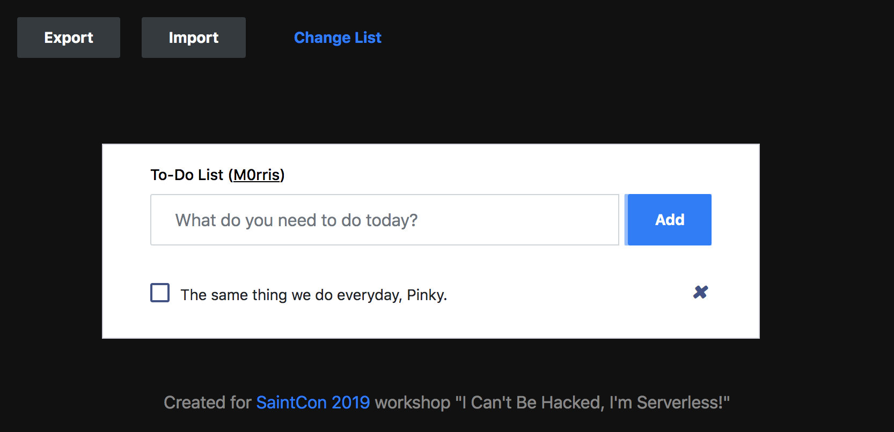

Items can be removed from the list by clicking the "x".

> Tip: Checking off items is only recorded on the frontend; refreshing the page will uncheck those items.

## Exporting and Importing

Let's export our current list.

When you click "Export", an XML document is created server-side and served to you. Save the file somewhere convenient on your computer and open it up in a text editor:

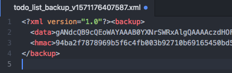

There is a `data` element, and an `hmac` element; let's use [CyberChef](https://gchq.github.io/CyberChef/) to look at the data using the `From Base64` plugin:

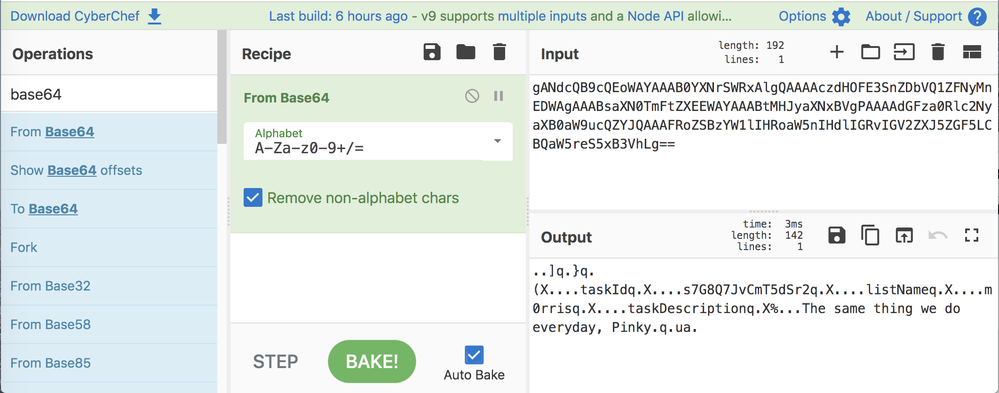

There are definitely identifiable strings in that output. We don't know the structure yet, but we know the exported data is not encrypted in any way.

The second field in the export file is `hmac`, which probably is used to authenticate the data we upload using the Import functionality; let's test that.

Modify the base64-encoded data in some way (pick a letter and change its case, for example), and save the file. For example, I changed the first letter in the `<data>` element:

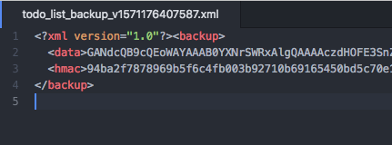

Now, using the Import feature, send the XML document to the server. You should get an error message from the server indicating that you've uploaded data with a mis-matching HMAC signature:

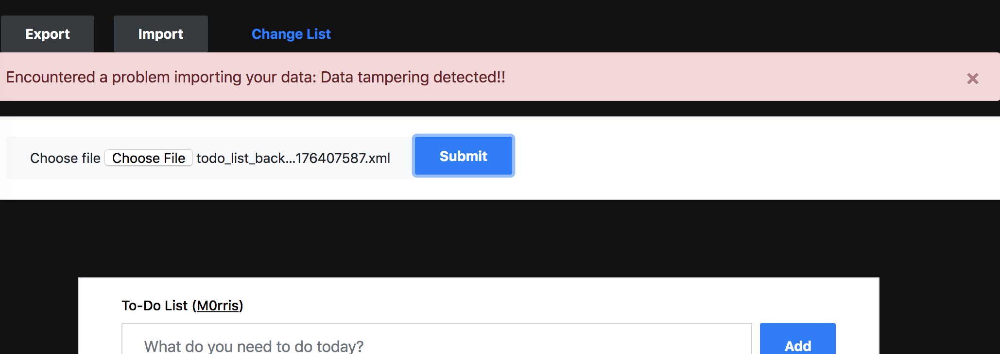

If we're going to "tamper" with these backups, we'll have to get the HMAC signing key from the server somehow.

## Cross-Site Scripting (XSS)

At this point, we know enough about this application to exploit one of its vulnerabilities. If you look at the HTML for this list, you'll see where the data we entered is displayed:

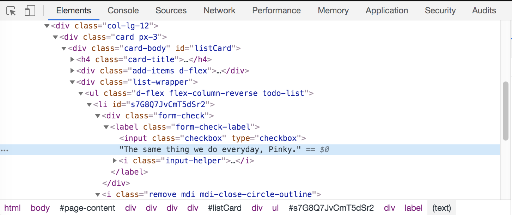

Because text is echoed directly back to the user, we can inject HTML onto the webpage in the form of a task. Let's demonstrate this by adding some HTML to our task list:

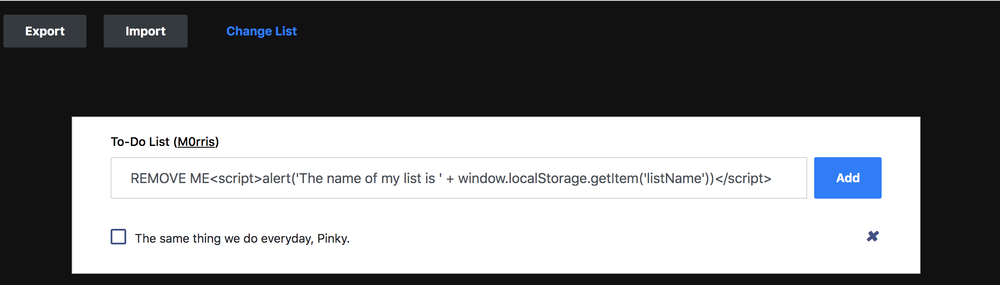

This Javascript snippet will read our list name from local storage and display it in an alert box:

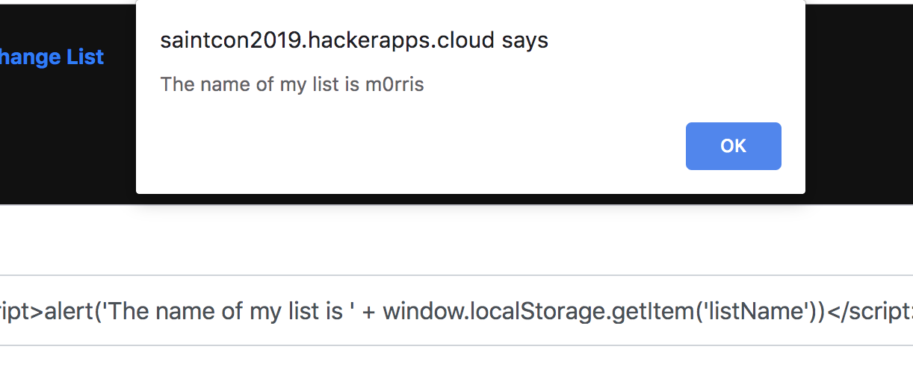

This is a particularly nasty [cross-site scripting (XSS)](https://www.owasp.org/index.php/Top_10-2017_A7-Cross-Site_Scripting_(XSS)) bug because it is also stored in the backend, so it will persist across sessions. You can clear it by deleting it as you would any other list entry.

## Recap

We learned how the web application works, and discovered a persistent cross-site scripting (XSS) vulnerability.

## Vulnerabilities covered

| Designation | Description | Comment |
| :---: | --- | --- |
| A7:2017 | Cross-Site Scripting (XSS) | Discovered a stored XSS bug in the to-do list |
