# Lab 2

## Introduction

In the previous lab, we discovered that the export function creates a backup of our to-do list items and serves the backup as an XML document. We also noticed that the exported data appears to be validated on the backend with an HMAC digest.

In this lab, you will find and exploit an XXE vulnerability, and use that to find the HMAC signing key.

## Methodology

Generally speaking, where an application is processing external input, the developer has to take particular care to handle input safely. In the case of this application, the import functionality parses XML and then pickle data, so let's explore:

1. What we're able to do with specially crafted data
2. What kind of feedback we can get from the application
3. Whether there's an XXE bug in the XML handler
4. What we can access

## Learning the Import function
We know from [Lab 1](./Lab1.md) that the export function generates an XML document; populate your To-Do list with a few items:

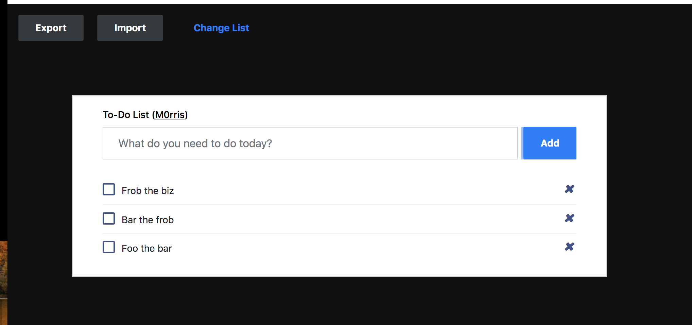

Now export your list, and save the file somewhere on your computer. Finally, delete all the items from your list. It should be completely empty.

Once you've done that, import the file you just exported:

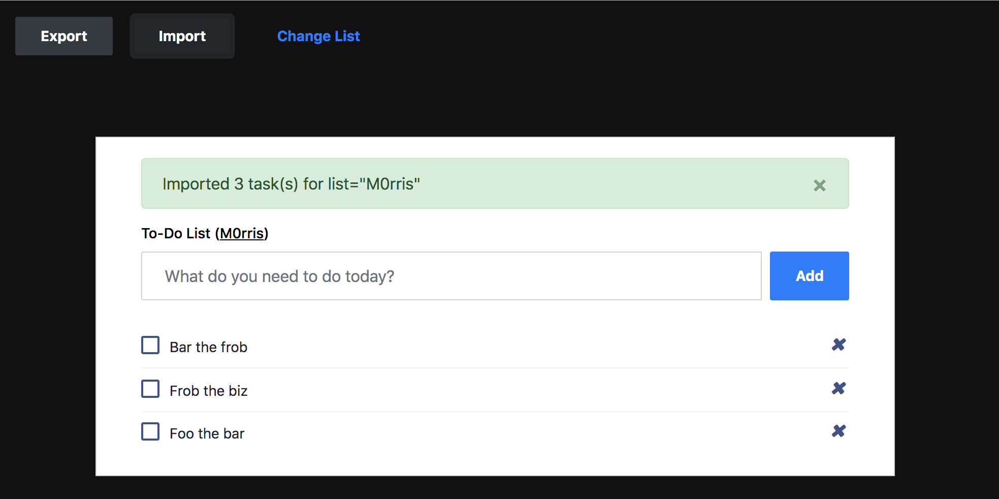

## Discovering level of feedback

Let's see what happens if we change the format of our XML document. Change the `backup` tag to `garbage` and try to import it your file:

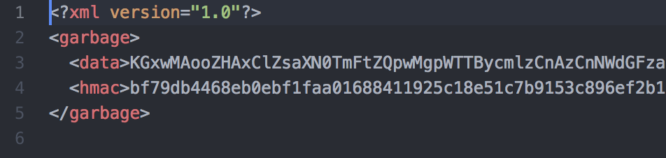

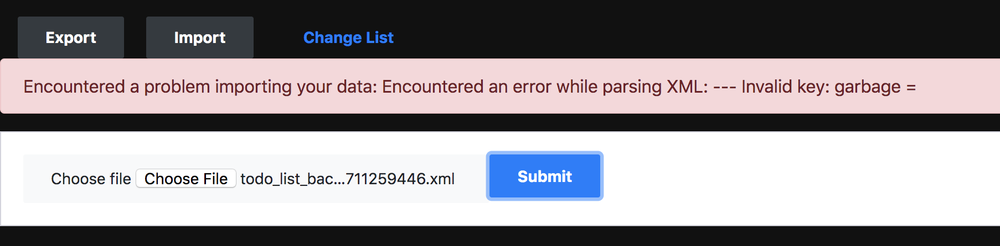

So, we get an error and processing stops if we include an invalid tag (i.e. other than `hmac`, `data`, and `backup`).

Interestingly, it seems like the error message includes the content of the invalid element. Let's test that theory, by changing that outer tag back to `backup` and adding a new element:

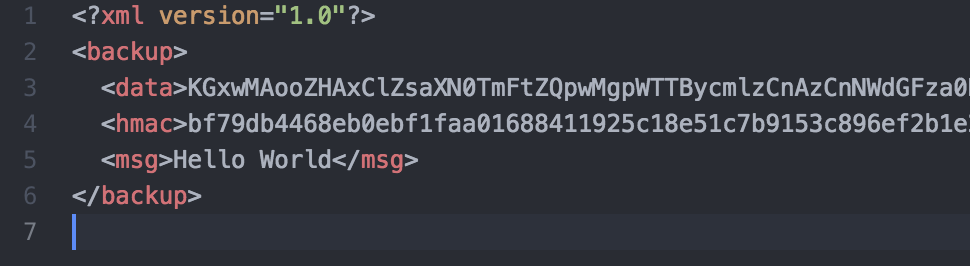

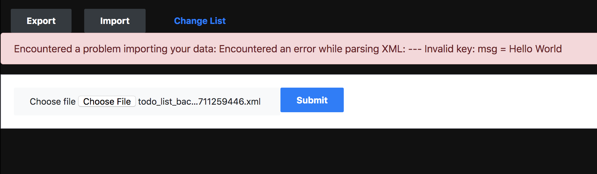

To test the application's behavior when critical elements are missing, delete the `data` and `hmac` elements and import your XML file. What happened?

## Discovering an XXE bug

From our previous work, we know that we can include and invalid element and the handler will return an error that includes the body of that element. This means that we can get the application to cough up data it thinks doesn't belong, which may make it a good candidate for XXE!

If an application is vulnerable to XXE, the XML parser is coerced into reading a resource from the network or from disk and echoing those contents back to the attacker. Let's see if we can make that happen here.

Create a malicious payload:

```
<?xml version="1.0" encoding="ISO-8859-1"?>
<!DOCTYPE msg [
  <!ELEMENT msg ANY >
  <!ENTITY data SYSTEM "file:///etc/hostname" >]><msg>&data;</msg>
```
In this payload, `msg` is declared as an element and `data` is declared as a SYSTEM resource. If the XML parser is vulnerable, it will load the contents of `/etc/hostname` into the `<msg>` element.

Let's upload this payload:

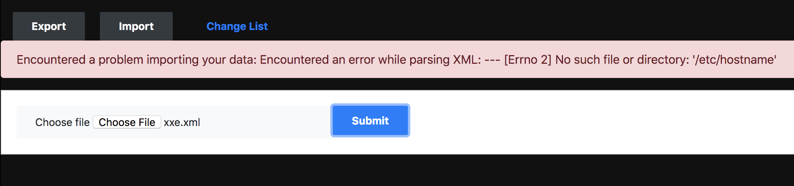

This is promising! Although the file we requested didn't exist, it looks like the handler tried to load our file from disk.

Let's try another file. Modify your XXE payload to read `/etc/hosts`, and upload it. What happened?

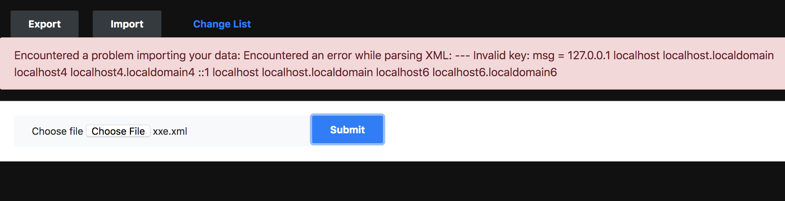

See if you can modify your XXE payload to read `/etc/passwd`.

A cleaner way to look at the data coming back, since newlines aren't rendered in the DOM, is to look at the HTML in your browser's inspector:

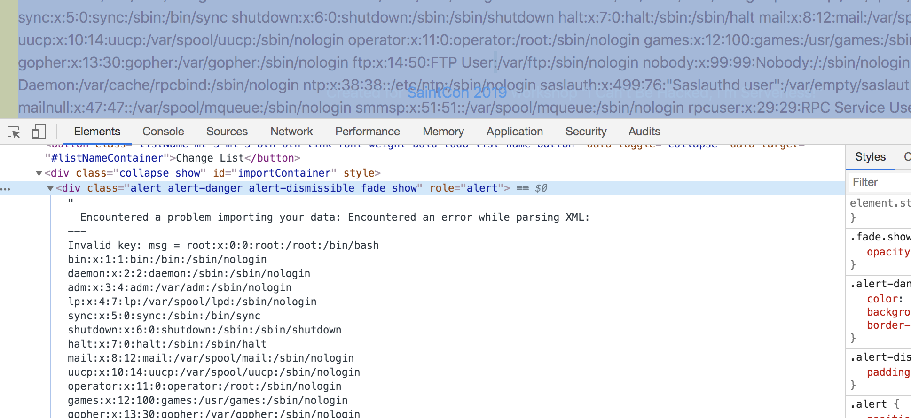

## Finding useful files

At this point, we can use the XXE to read files on disk. Let's see what we can find!

We know that serverless functions live in containers, and secrets are injected into those containers via the environment and the filesystem. Let's attempt to read environments variables via `/proc/self/environ`:

```
<?xml version="1.0" encoding="ISO-8859-1"?>
<!DOCTYPE msg [
  <!ELEMENT msg ANY >
  <!ENTITY data SYSTEM "file:///proc/self/environ" >]><msg>&data;</msg>
```

It looks like we can't read this file directly; the parser appears to be breaking on invalid characters, and since this file contains null-byte-separated environment variables, it is probably breaking on a null-byte.

Let's look for special mounted files:

```
<?xml version="1.0" encoding="ISO-8859-1"?>
<!DOCTYPE msg [
  <!ELEMENT msg ANY >
  <!ENTITY data SYSTEM "file:///proc/mounts" >]><msg>&data;</msg>
```

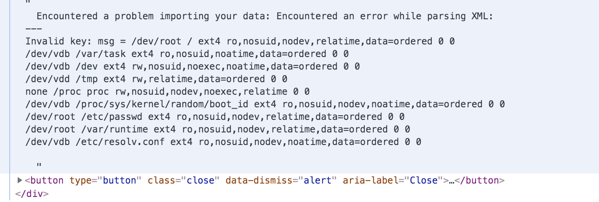

There are no out-of-the-ordinary files mounted here. Notice the `/var/task` mount, that's the directory Lambda uses to store the source code for the application. Let's try to find that source code; finding it will shed more light on how this application works on the backend, and the source code could potentially contain useful secrets.

In the [AWS SAM examples](https://github.com/awslabs/serverless-application-model/tree/master/examples/apps/hello-world-python), the code for Python examples is often put in a file called `lambda_function.py`. Let's try searching for that:

```
<?xml version="1.0" encoding="ISO-8859-1"?>
<!DOCTYPE msg [
  <!ELEMENT msg ANY >
  <!ENTITY data SYSTEM "file:///var/task/lambda_function.py" >]><msg>&data;</msg>
```


Using that XXE vulnerability, we're able to disclose the source code of the serverless application:

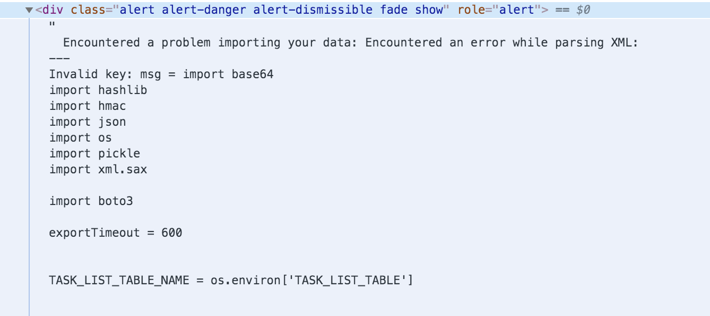

You can read the Python underlying the serverless backend, and better understand how the application works. No more guessing! Do you see anything immediately valuable?

## Recap

By poking around, we were able to determine that including invalid XML elements would cause the web app to spit out the tag and contents of the element. We were able to leverage that to read files from disk in the container via an XML external entities (XXE) vulnerability in the XML handling code.

Finally, we were able to access the source code for the entire serverless application, which contains a secret!

## Vulnerabilities covered

| Designation | Description | Comment |
| :---: | --- | --- |
| A3:2017 | Sensitive Data Exposure | Sensitive data on disk is leaked via XXE |
| A4:2017 | XML External Entities (XXE) | The import functionality is vulnerable to XXE |
| A6:2017 | Security Misconfiguration | An HMAC key is stored/exposed in the function's source code |
| A9:2017 | Using Components with Known Vulnerabilities | XXE in xml.sax library is mitigated in Python 3.7.1 |
